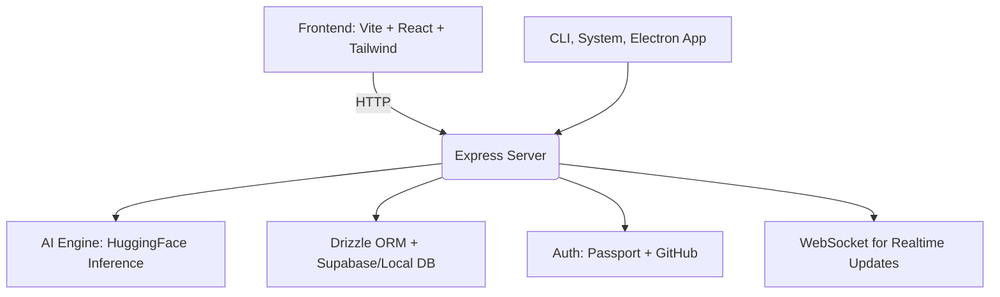

# Alpha-Q: AI Application Builder


Alpha-Q is an intelligent application builder that leverages AI to help developers create, manage, and deploy applications efficiently.

---

## ✨ Features

* 🧐 Natural Language & Voice AI (local text + voice)
* 📀 Persistent Memory (Supabase DB or local DB + vector store)
* 💻 Full-Stack Code Creation, Issue Fixing, Deployment
* 🖥️ System Control & CLI Execution
* 🌐 Web Preview, Build & Deploy
* 🔐 Auth + GitHub Integration
* 🤸‍ Browser & Internet Automation
* 🧕 User-Centric Learning & Context Retention

---

## 📊 System Architecture



---

## ✅ Prerequisites

* Python 3.11+
* Git
* Virtual environment (recommended)
* Hugging Face account and API token
* Google Colab account (optional, for cloud offloading)
* Supabase account (optional, for database)

---

## ⚙️ Installation

### 1. Clone the repository:

```bash
git clone https://github.com/alphaqmoi/alpha-q.git
cd alpha-q
```

### 2. Setup (auto):

```bash
./setup-dev.sh  # macOS/Linux
# OR on Windows:
setup-dev.bat
```

### 3. Manual Setup (alternative):

```bash
python -m venv venv
source venv/bin/activate  # Windows: venv\Scripts\activate
pip install -r requirements.txt
pip install -r requirements-dev.txt
pre-commit install
pre-commit autoupdate
```

---

### 4. Configure Environment:

`.env` example:

```env
FLASK_APP=app.py
FLASK_ENV=development
SESSION_SECRET=your-secret-key
HUGGINGFACE_TOKEN=your-huggingface-token
SUPABASE_URL=your-supabase-url
SUPABASE_ANON_KEY=your-supabase-anon-key
SUPABASE_SERVICE_ROLE_KEY=your-supabase-service-role-key
JWT_SECRET=your-jwt-secret
```

---

### 5. Initialize Database:

```bash
flask db upgrade
```

---

## 🧪 Development

### 🔨 Commands

| Action         | Command             |
| -------------- | ------------------- |
| Setup          | `make setup`        |
| Run app        | `make run`          |
| Run prod app   | `make run-prod`     |
| Lint code      | `make lint`         |
| Format code    | `make format`       |
| Run tests      | `make test`         |
| Clean project  | `make clean`        |
| Build Docker   | `make docker-build` |
| Up Docker      | `make docker-up`    |
| Down Docker    | `make docker-down`  |
| DB Migrate     | `make migrate`      |
| Init AI Models | `make init-models`  |

### Yarn/Web Frontend (Optional):

```bash
yarn dev        # Start dev server
yarn build      # Build production frontend
yarn start      # Start server
yarn check      # TypeScript check
yarn lint       # ESLint
yarn db:push    # Push DB changes
```

---

## 📂 Project Structure

```
alpha-q/
├── frontend/         # React + Vite frontend
├── server/           # Express server backend
├── shared/           # Shared types/utils
├── database/         # ORM + Drizzle + Schema
├── scripts/          # Utility scripts
├── .env              # Environment variables
├── setup-dev.sh      # Auto setup script
├── README.md         # You're here
```

---

## 🌐 Web Routes

* `/` - Main Interface
* `/chat` - AI Assistant
* `/models` - Model Manager
* `/system` - System/CLI Control
* `/monitor` - Realtime Monitoring

---

## 📺 Example Usage GIFs

| Feature              | GIF Preview                                                         |
| -------------------- | ------------------------------------------------------------------- |
| Build via Prompt     |  |
| Run System CLI       |          |
| Monitor System Stats |  |
| Web Browse with AI   |       |

---

## 🈺 Localized Versions

### 🇺🇸 English (Default)

You are reading the English version.

### 🇪🇸 Español (beta)

**Alpha-Q: Constructor Inteligente de Aplicaciones**

* Controla tu sistema usando lenguaje natural.
* Crea y despliega apps completas con IA.
* Visualiza y ajusta el frontend en vivo.
* Automatización con GitHub, Supabase y más.

*...más traducciones próximamente...*

---

## 👍 Contributing

1. Fork the repo
2. Create a feature branch
3. Commit your changes
4. Push and open a PR

---

## 📄 License

MIT License — see `LICENSE` for full details.

---

## 🛠️ Support

Please open an issue or start a GitHub Discussion for help.

---
