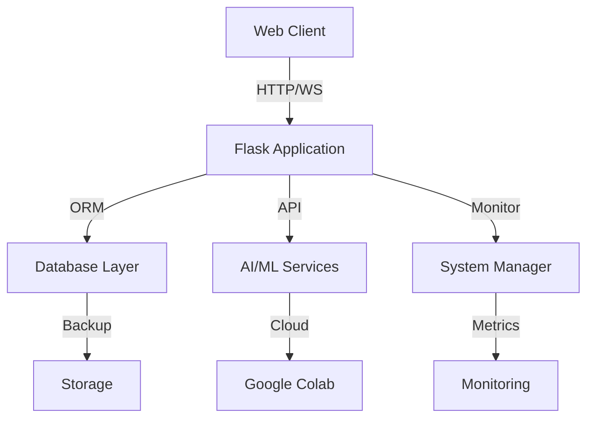

# Alpha-Q Architecture Overview

## System Architecture

Alpha-Q is built with a modular, extensible architecture that follows clean code principles and separation of concerns.

### Core Components

1. **Web Application Layer**
   - Flask-based web server
   - RESTful API endpoints
   - WebSocket support for real-time features
   - JWT-based authentication
   - CORS support for cross-origin requests

2. **Database Layer**
   - Supabase integration for primary database
   - SQLAlchemy ORM for database operations
   - Migration management with Flask-Migrate
   - Backup and restore functionality
   - Vector store for AI model embeddings

3. **AI/ML Layer**
   - Hugging Face Transformers integration
   - Model management and versioning
   - Resource monitoring and optimization
   - Cloud offloading to Google Colab
   - Model caching and persistence

4. **System Management**
   - Resource monitoring (CPU, Memory, GPU)
   - Process management
   - Cloud integration
   - Backup and recovery
   - Logging and monitoring

### Component Interaction



## Key Design Decisions

1. **Modularity**
   - Each component is self-contained
   - Clear interfaces between modules
   - Easy to extend and maintain
   - Plugin architecture for new features

2. **Scalability**
   - Cloud offloading for heavy computations
   - Resource-aware model loading
   - Efficient database operations
   - Caching strategies

3. **Security**
   - JWT-based authentication
   - Environment variable management
   - Secure API endpoints
   - Input validation
   - Rate limiting

4. **Reliability**
   - Comprehensive error handling
   - Automatic backup system
   - Health monitoring
   - Graceful degradation

## Data Flow

1. **User Request Flow**
   ```
   Client Request
   → Authentication
   → Request Validation
   → Business Logic
   → Database Operation
   → Response Generation
   → Client Response
   ```

2. **AI Model Flow**
   ```
   Model Request
   → Resource Check
   → Model Selection
   → Load/Cache Model
   → Process Request
   → Return Results
   ```

3. **System Monitoring Flow**
   ```
   Resource Check
   → Metrics Collection
   → Threshold Check
   → Action Trigger
   → Status Update
   → Logging
   ```

## Configuration Management

1. **Environment Configuration**
   - Development/Production settings
   - Environment variables
   - Feature flags
   - Resource limits

2. **Model Configuration**
   - Model parameters
   - Resource requirements
   - Caching policies
   - Offloading rules

3. **System Configuration**
   - Monitoring thresholds
   - Backup schedules
   - Logging levels
   - Security settings

## Security Architecture

1. **Authentication**
   - JWT token management
   - Role-based access control
   - Session management
   - OAuth integration

2. **Data Security**
   - Encrypted storage
   - Secure communication
   - Input sanitization
   - Output encoding

3. **System Security**
   - Resource isolation
   - Rate limiting
   - Audit logging
   - Security headers

## Monitoring and Logging

1. **System Monitoring**
   - Resource utilization
   - Performance metrics
   - Error tracking
   - Health checks

2. **Application Logging**
   - Request logging
   - Error logging
   - Audit logging
   - Performance logging

3. **Alerting**
   - Resource thresholds
   - Error conditions
   - Security events
   - Performance issues

## Deployment Architecture

1. **Development**
   - Local development setup
   - Testing environment
   - CI/CD pipeline
   - Code quality checks

2. **Production**
   - Containerized deployment
   - Load balancing
   - Database replication
   - Backup strategy

3. **Scaling**
   - Horizontal scaling
   - Vertical scaling
   - Resource optimization
   - Cost management

## Future Considerations

1. **Planned Improvements**
   - Microservices architecture
   - Enhanced cloud integration
   - Advanced caching
   - Improved monitoring

2. **Scalability Plans**
   - Distributed processing
   - Multi-region deployment
   - Advanced load balancing
   - Enhanced security

3. **Feature Roadmap**
   - Additional AI models
   - Enhanced analytics
   - Extended API capabilities
   - Improved user experience
